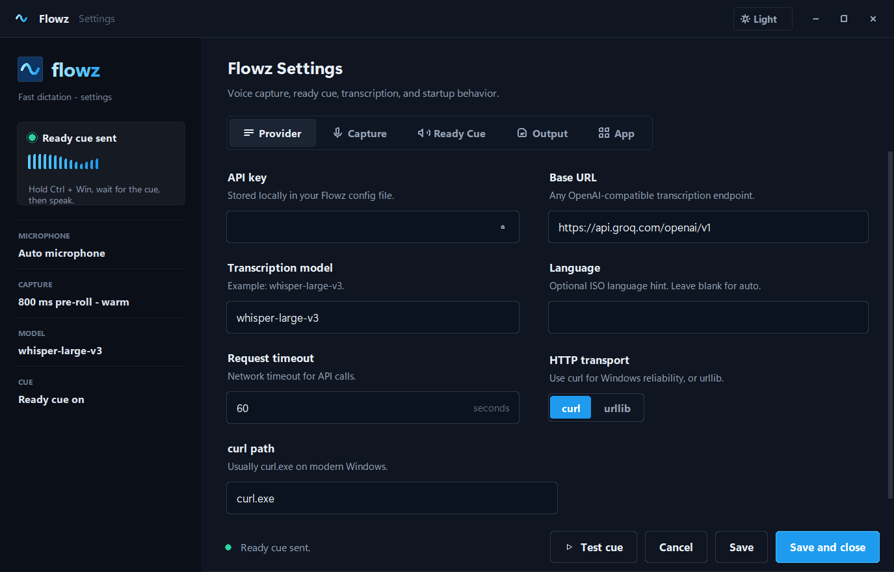

<p align="center">
  
</p>

<p align="center">
  <strong>Fast voice dictation for Windows.</strong><br>
  Hold a hotkey, speak, release, and Flowz pastes the text where your cursor is.
</p>

<p align="center">
  <a href="#features">Features</a> -
  <a href="#screenshot">Screenshot</a> -
  <a href="#quick-start">Quick start</a> -
  <a href="#using-flowz">Using Flowz</a> -
  <a href="#settings">Settings</a> -
  <a href="#donate">Donate</a>
</p>

---

## Why Flowz

Flowz is a Windows-first voice dictation app for people who want a fast way to
write in any text field.

The workflow is simple:

1. Focus any text box.
2. Hold `Ctrl + Windows`.
3. Speak after the ready cue.
4. Release the keys.
5. Flowz transcribes and pastes the text.

Flowz is not affiliated with Wispr Flow or its makers.

## Features

- Hold-to-dictate hotkey: `Ctrl + Windows`.
- Fast microphone capture with pre-roll, so the first word is not clipped.
- Ready sound before recording.
- Automatic paste with clipboard preservation.
- Clean on-screen indicator for ready, listening, transcribing, and pasted states.
- Settings window with dark and light themes.
- Optional Start with Windows support.
- Tray menu for quick controls.

## Screenshot

<p align="center">
  
</p>

## Requirements

- Windows 10 or Windows 11.
- A microphone.
- An API key for transcription.
- `ffmpeg`, selected or configured in settings.

Running from source also requires Python 3.10 or newer.

## Quick Start

Open settings:

```powershell
.\Flowz.bat --settings
```

Run Flowz:

```powershell
.\Flowz.bat
```

Install for the current Windows user:

```powershell
.\install.ps1 -Build
```

Install and start automatically with Windows:

```powershell
.\install.ps1 -Build -StartWithWindows
```

Uninstall:

```powershell
.\uninstall.ps1
```

## Using Flowz

1. Click where you want the text to appear.
2. Hold `Ctrl + Windows`.
3. Wait for the cue or the indicator to show that Flowz is listening.
4. Speak normally.
5. Release the keys.

Flowz pastes the transcription into the active app.

## Settings

Most setup happens in the Flowz Settings window:

```powershell
.\Flowz.bat --settings
```

Common things to configure:

- API key and transcription provider.
- Microphone device.
- Ready sound.
- Paste behavior.
- Visual indicator.
- Start with Windows.

## Troubleshooting

Open Flowz Settings and check the microphone, ready sound, and API connection.
The settings window includes quick tests for the most common setup issues.

## Donate

If Flowz saves you time, donations are welcome.

EVM address:

```text
0x5d72a048D7bd477DC25Bd34Be8Ca0bD58d3db0B4
```

## Privacy

- Your API key is stored locally.
- Audio is sent for transcription only when you release the dictation hotkey.
- If warm capture is enabled, Windows may show the microphone as active while
  Flowz is waiting for the next dictation.
